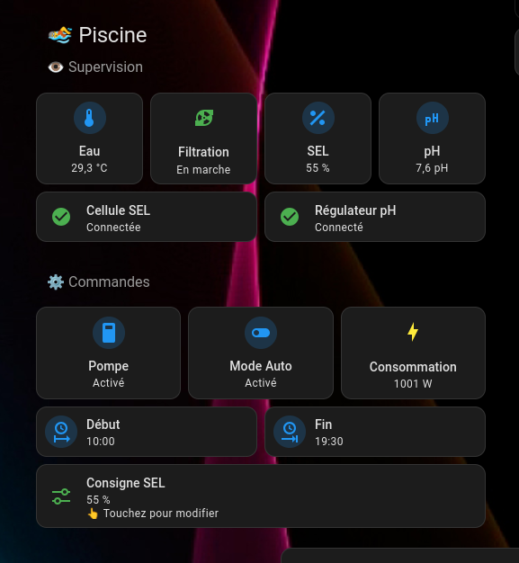

# 🏊 Sterilor XP ESPHome

> **Native ESPHome integration for Sterilor XP salt chlorinator and pH regulator using Bluetooth Low Energy (BLE).**

**⭐ First open-source ESPHome integration dedicated to Sterilor XP devices.**

---



---

# ✨ Features

## 📊 Monitoring

- 💧 Read pool water pH
- ⚡ Read salt chlorinator production
- 🟢 Monitor BLE connectivity
- 📡 Device status monitoring

## 🎛 Control

- ⚙ Change chlorinator production setpoint

## 🏠 Home Assistant

- Native ESPHome device
- Mushroom Dashboard included
- 100% local communication
- No cloud
- No proprietary gateway

---

# 📸 Hardware

| ESP32 | Sterilor XP |
|:------:|:-----------:|
 | 

Compatible with:

- Sterilor XP Salt Chlorinator
- Sterilor XP pH Regulator
- ESP32 (Wi-Fi or Ethernet)
- Home Assistant
- ESPHome

---

# 🍄 Dashboard

A complete Mushroom dashboard is included.

It provides:

- Pool water temperature
- Filtration status
- Salt production
- Pool pH
- Cell connectivity
- pH regulator connectivity
- Filtration controls
- Production setpoint adjustment


---

# 📦 Installation

Installation takes only a few minutes.

1. Flash the ESP32 with the provided ESPHome configuration.
2. Configure the Bluetooth MAC addresses.
3. Add the device to Home Assistant.
4. Import the Mushroom dashboard.

Detailed instructions are available in:

```
docs/installation.md
```

---

# 📡 BLE Protocol

The Bluetooth Low Energy protocol has been completely reverse engineered from real Sterilor XP devices.

Currently supported:

- ✅ Production reading
- ✅ Production setpoint writing
- ✅ Pool pH reading
- ✅ Device status monitoring

Technical documentation is available in:

```
protocol.md
```

---

# 📁 Repository structure

```
Sterilor-ESPHome/

├── esphome/
│   └── Sterilor_ESPHome_V1.0.1.yaml
│
├── dashboard/
│   └── dashboard_mushroom.yaml
│
├── docs/
│   └── installation.md
│
├── images/
│   ├── dashboard.png
│   ├── esp32.png
│   └── sterilor.png
│
├── protocol.md
│
└── README.md
```

---

# 🚀 Project status

| Component | Status |
|-----------|--------|
| ESPHome firmware | ✅ Stable |
| Dashboard | ✅ Stable |
| BLE communication | ✅ Stable |
| Salt chlorinator | ✅ Supported |
| pH regulator | ✅ Supported |

Current release:

**Version 1.0.1**

---

# 🗺 Roadmap

## Version 1.1

- pH setpoint writing
- BLE RSSI monitoring
- Improved diagnostics

## Future

- Additional Sterilor models
- Automatic BLE discovery
- New dashboard widgets

---

# ⚠ Disclaimer

This project is **not affiliated with, endorsed by, or supported by Sterilor**.

Sterilor is a trademark of its respective owner.

---

# 🤝 Contributing

Bug reports, feature requests and pull requests are welcome.

If you own another Sterilor model, your feedback is greatly appreciated.

---

# 🙏 Credits

This project was developed through:

- Bluetooth Low Energy reverse engineering
- ESPHome development
- Home Assistant integration
- Extensive real-world testing

Its goal is to provide the Home Assistant community with a reliable, fully local and easy-to-use integration for Sterilor XP devices.

---

# 📄 License

MIT License.
