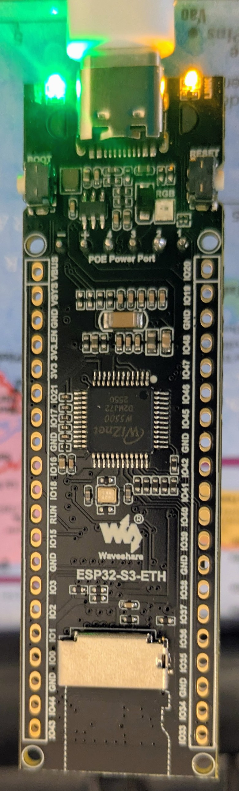
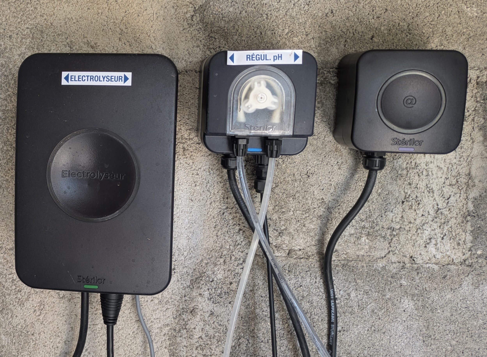

# 🏊 Sterilor XP ESPHome

> **Native ESPHome integration for Sterilor XP salt chlorinator and pH regulator using Bluetooth Low Energy (BLE).**


---

# 📖 The Story

Sterilor XP pool controllers include a Bluetooth Low Energy (BLE) interface, but no Home Assistant integration was publicly available.

This project originated from a reverse engineering effort of the BLE protocol, carried out **without any official documentation**.

Starting from Bluetooth packet captures, HCI logs and protocol analysis, the project progressively evolved into a complete ESPHome integration capable of:

- 💧 Reading pool water pH
- ⚡ Reading salt chlorinator production
- 🎛 Changing the production setpoint
- 📡 Monitoring BLE connectivity
- 🏠 Integrating seamlessly into Home Assistant
- 🍄 Providing a ready-to-use Mushroom dashboard

The objective has always been simple:

> **Provide Sterilor XP owners with a reliable, fully local and open-source Home Assistant integration.**

---

# ✨ Features

## 📊 Monitoring

- Read pool water pH
- Read salt chlorinator production
- Monitor BLE connectivity
- Device status monitoring

## 🎛 Control

- Change salt production setpoint

## 🏠 Home Assistant

- Native ESPHome integration
- Mushroom dashboard included
- 100% local communication
- No cloud
- No proprietary gateway

---

# 📸 Hardware

| ESP32 | Sterilor XP |
|:------:|:-----------:|
|  |  |


Supported hardware:

- Sterilor XP Salt Chlorinator
- Sterilor XP pH Regulator
- ESP32 (Wi-Fi or Ethernet)
- Home Assistant
- ESPHome

---

# 🍄 Dashboard

A complete Mushroom dashboard is included.

It provides:

- 🌡 Pool water temperature
- 🍃 Filtration status
- ⚡ Salt production
- 💧 Pool pH
- 🟢 Salt cell connectivity
- 🟢 pH regulator connectivity
- 🎛 Filtration controls
- ⚙ Salt production adjustment

The complete dashboard configuration is included in:

```
dashboard/dashboard_mushroom.yaml
```

---

# 📦 Installation

Installation only takes a few minutes.

1. Flash the ESP32 using the supplied ESPHome configuration.
2. Configure the Bluetooth MAC addresses of your Sterilor devices.
3. Add the ESPHome device to Home Assistant.
4. Import the Mushroom dashboard.

Detailed instructions are available in:

```
docs/installation.md
```

---

# 🔧 Hardware

Hardware recommendations, installation advice and ESP32 selection are available in:

```
docs/hardware.md
```

---

# 📡 BLE Protocol

The Bluetooth protocol has been completely reverse engineered from real Sterilor XP devices.

Currently implemented:

- ✅ Production reading
- ✅ Production setpoint writing
- ✅ Pool pH reading
- ✅ BLE connection monitoring

Technical documentation is available in:

```
protocol.md
```

---

# 📁 Repository Structure

```
Sterilor-ESPHome/

├── esphome/
│   └── Sterilor_ESPHome_V1.0.1.yaml
│
├── dashboard/
│   └── dashboard_mushroom.yaml
│
├── docs/
│   ├── installation.md
│   └── hardware.md
│
├── images/
│   ├── dashboard.png
│   ├── esp32.png
│   └── sterilor.png
│
├── protocol.md
├── CHANGELOG.md
└── README.md
```

---

# 🚀 Project Status

| Component | Status |
|-----------|--------|
| ESPHome Firmware | ✅ Stable |
| Dashboard | ✅ Stable |
| BLE Communication | ✅ Stable |
| Salt Chlorinator | ✅ Supported |
| pH Regulator | ✅ Supported |

Current version:

**v1.0.1**

---

# 🗺 Roadmap

## Version 1.1

- pH setpoint writing
- RSSI monitoring
- Advanced diagnostics

## Future

- Additional Sterilor models
- Automatic BLE discovery
- Extended diagnostics

---

# 🤝 Contributing

Bug reports, feature requests and Pull Requests are welcome.

If you own another Sterilor device and would like to help test compatibility, your feedback is greatly appreciated.

---

# 🙏 Acknowledgements

This project is the result of a collaboration between a passionate Home Assistant user and ChatGPT.

It was developed iteratively through:

- Bluetooth Low Energy packet analysis
- Android HCI captures
- Python reverse engineering tools
- ESP32 experimentation
- ESPHome development
- Extensive validation on a real Sterilor XP installation

The goal was not only to make the system work, but also to create a clean, documented and easy-to-use open-source project that anyone can install and improve.

Special thanks to the Home Assistant and ESPHome communities for providing the outstanding ecosystem that made this project possible.

---

# ⚠ Disclaimer

This project is **not affiliated with, endorsed by, or supported by Sterilor**.

Sterilor is a trademark of its respective owner.

---

# 📄 License

Released under the MIT License.
